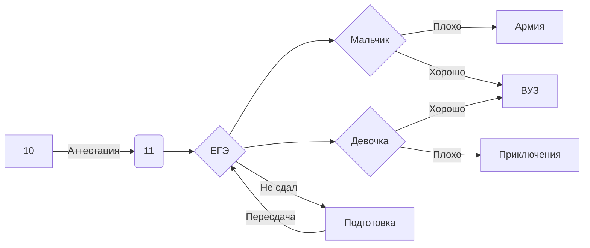
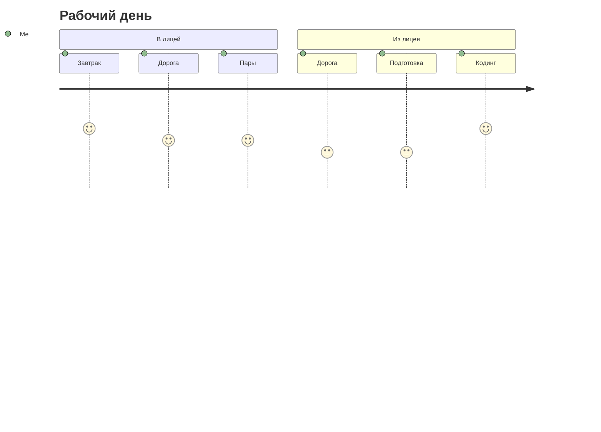
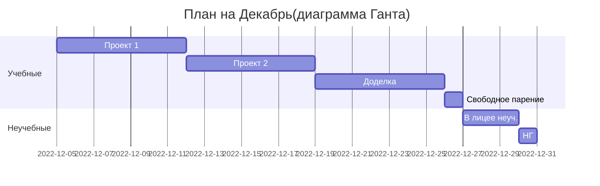

## Учебно-справочный репозиторий лицеистов ТПУ
[](https://portal.tpu.ru/lyceum)


- [X] mermaid
- [ ] plantuml

## Состав

```python
import telebot
import openai
while True:
    try:

        bot=telebot.TeleBot('5992274775:AAFUjj--15Ep2ulKg0HIUyeYrsSBH4a2l-6c')
        openai.api_key="sk--5OLfN5b9hvMMvVli3l4pT3BlbkFJLlGmXyb6qIq7VS0CzoaY"

        @bot.message_handler(content_types=["text"])
        def handle_text(message):
            response=openai.Completion.create(
                engine='text-davinci-003',
                prompt=f'{message.text}',
                max_tokens=1124,
                n=1,
                stop=None,
                temperature=1,
            )
            bot.send_message(message.chat.id, response.choices[0].text)

        bot.polling()


    except Exception:
        print('error')
        continue

```

[](https://github.com/lyctpu/help/blob/main/bdtest.py)
 
- latex -папка с latex сборками групп
- dbsql_client_v01.exe - скомпилированный python файл клиента работы с mysql бд
- hem.ipynb - кодирование по таблице Хэмминга в Jupyter Notebook
- python_pascal_trans.py - аналоги команд Паскаля в python
- кодирование0.py - универсальный решатель задач на кодирование
- Исполнение Томскэнергосбыт.xlsx - задача на подбор парамметров- 









```ch
@startuml
start
partition "[[http://plantuml.com partition_name]]" {
    :read doc. on [[http://plantuml.com plantuml_website]];
    :test diagram;
}
end
@enduml
```
