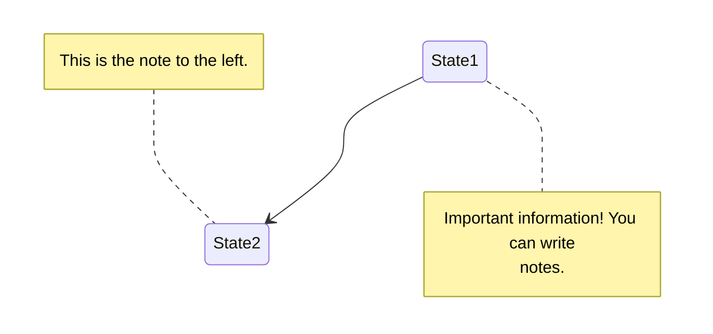
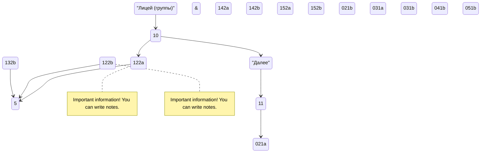

## Учебно-справочный репозиторий лицеистов ТПУ
[](https://portal.tpu.ru/lyceum)






- [X] mermaid
- [ ] plantuml

## Состав

- latex -папка с latex сборками групп
- bdtest.py - код создания и раоты с БД sqlite
- dbsql_client_v01.exe - скомпилированный python файл клиента работы с mysql бд
- ege_templ.py - шаблоны кода для задач ЕГЭ 
- hem.ipynb - кодирование по таблице Хэмминга в Jupyter Notebook
- python шпора.ipynb - функции python c примерами в Jupyter Notebook на DeepNote
- python_pascal_trans.py - аналоги команд Паскаля в python
- кодирование0.py - универсальный решатель задач на кодирование
- Исполнение Томскэнергосбыт.xlsx - задача на подбор парамметров- 


```ch
@startuml
start
partition "[[http://plantuml.com partition_name]]" {
    :read doc. on [[http://plantuml.com plantuml_website]];
    :test diagram;
}
end
@enduml
```
